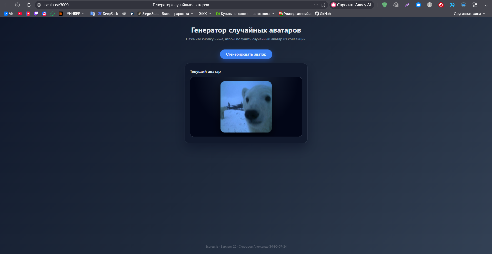

# Генератор случайных аватаров  
### Контрольная работа по Express.js — Вариант 25  
Автор: **Скворцов Александр, ЭФБО-07-24**

---

## Описание проекта

Приложение представляет собой сервер на Express.js, который генерирует случайные аватары из набора заранее загруженных изображений.  
Сервер предоставляет API для получения случайного аватара, работы с коллекцией аватаров, а также включает клиентскую часть для визуального отображения результата.

